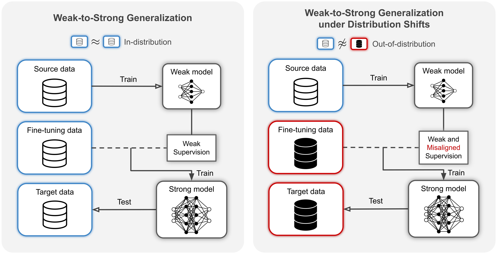

# Weak-to-Strong Generalization under Distribution Shifts

[Myeongho Jeon*](https://myeongho.com), [Jan Sobotka*](https://johnny1188.github.io), [Suhwan Choi*](#), [Maria Brbić](https://brbiclab.epfl.ch/team/)

<!-- [`Project page`](https://brbiclab.epfl.ch/projects/raven/) -->

---

<div align="justify">
As future superhuman models become increasingly complex, accurately supervising their behavior may exceed human capabilities. Recent works have demonstrated that in such scenario weak models can effectively supervise strong models, a phenomenon known as weak-to-strong generalization. However, we find that naive weak-to-strong generalization fails under distribution shifts, often leading to worse performance of the strong model than its weak supervisors. To address this, we propose RAVEN, a robust weak-to-strong generalization framework that dynamically learns the optimal combinations of weak models in addition to parameters of the strong model. We demonstrate the effectiveness of RAVEN on image classification, text classification and preference alignment tasks. RAVEN outperforms alternative baselines by over 40% on out-of-distribution tasks while matching or surpassing existing methods on in-distribution tasks. Moreover, our results show that RAVEN assigns higher weights to more accurate weak models, demonstrating its ability to automatically identify trustworthy supervision.
</div>

</br>

<div align="center">

</div>

</br>

<div align="justify">
The repository contains code for the image classification, text classification, and preference alignment experiments in the paper. The environment setup and instructions for running the individual experiments can be found in the respective folders:
</div>

- Image classification: [`rw2s/vision/README.md`](rw2s/vision/README.md)
- Text classification: [`rw2s/NLP/README.md`](rw2s/NLP/README.md)
- Preference alignment: [`rw2s/reward_modeling/README.md`](rw2s/reward_modeling/README.md)

---
### Citing
```
```
<!-- 
If you find RAVEN useful, please consider citing:
```
@article{jeon2024raven,
  title={Weak-to-Strong Generalization under Distribution Shifts},
  author={Jeon, Myeongho and Sobotka, Jan and Choi, Suhwan and Brbic, Maria},
}
``` -->